# RWA 서비스 아키텍처 문서

## 개요

본 문서는 DS Token을 기반으로 한 RWA(Real World Asset) 서비스의 전체 아키텍처를 설명합니다. 시스템은 발행사와 투자자 관점에서 각각의 흐름을 가로축 레이어(Frontend, Backend, Contract, Bank, 국가기관)로 구성하여 상세히 다룹니다.

## 시스템 구성 요소

### 핵심 컴포넌트

1. **DSToken**: ERC-20 기반 증권형 토큰 (규제 훅 및 관리 기능 포함)
2. **ComplianceService**: 규제 검증 서비스
3. **TrustService**: 역할/권한 관리 서비스  
4. **RegistryService**: 투자자 정보 및 지갑 매핑 관리
5. **Backend Services**: 비즈니스 로직 및 오프체인 처리
6. **Frontend Applications**: 사용자 인터페이스

### 레이어 구조

```
┌─────────────────┬─────────────────┬─────────────────┬─────────────────┬─────────────────┐
│   Frontend      │    Backend      │    Contract     │      Bank       │    국가기관      │
│                 │                 │                 │                 │                 │
│ - 발행사 대시보드  │ - API 서버      │ - DSToken       │ - FIAT 입출금   │ - 규제 감독     │
│ - 투자자 포털    │ - 백오피스      │ - Compliance    │ - 정산 시스템   │ - KYC 검증      │
│ - 모바일 앱      │ - 웹훅 처리      │ - Trust         │ - 웹훅/API     │ - 보고서 수집   │
│                 │ - 이벤트 처리    │ - Registry      │                 │                 │
└─────────────────┴─────────────────┴─────────────────┴─────────────────┴─────────────────┘
```

---

## 발행사 관점 시스템 흐름

### 1. 토큰 발행 준비 단계

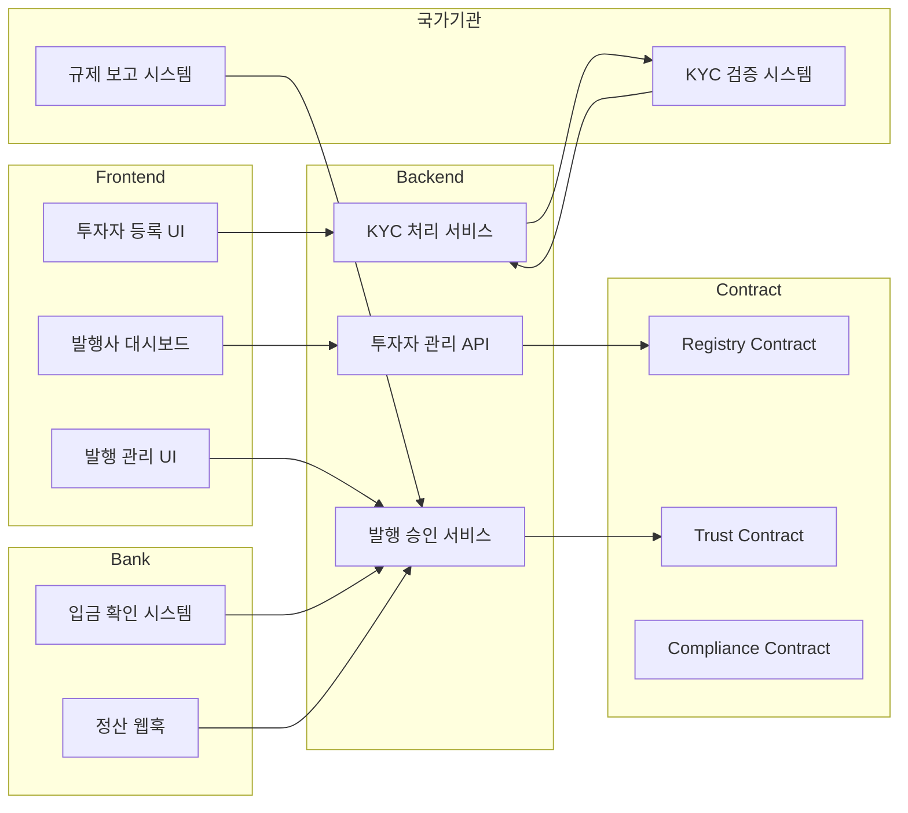

### 2. 투자자 온보딩 프로세스

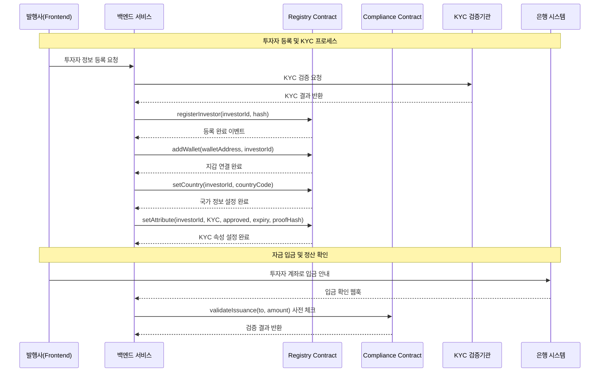

### 3. 토큰 발행 프로세스

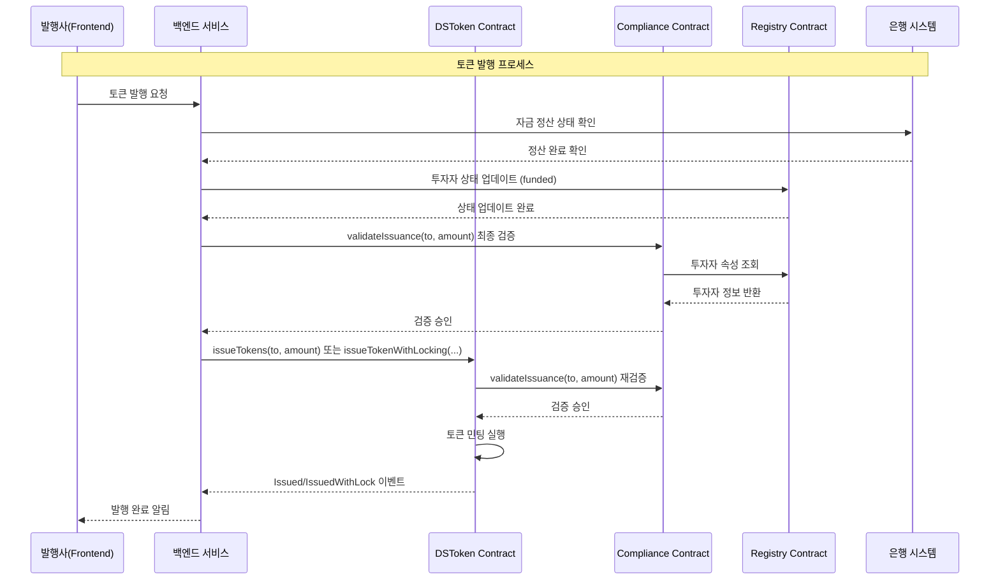

---

## 투자자 관점 시스템 흐름

### 1. 투자자 등록 및 인증

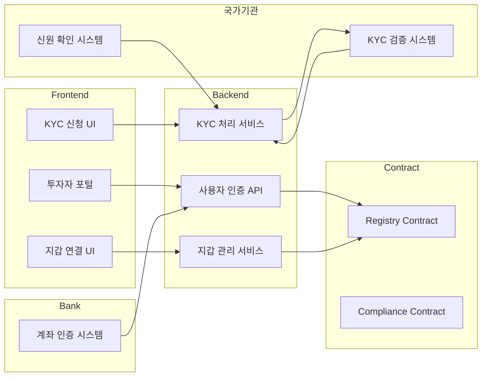

### 2. 투자 프로세스

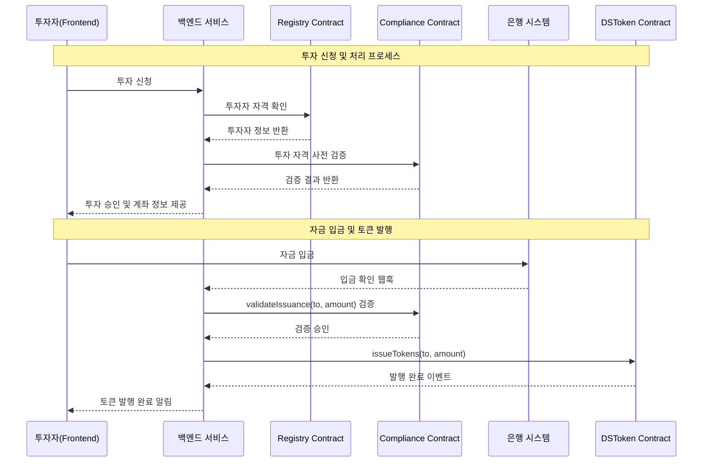

### 3. 토큰 전송 프로세스

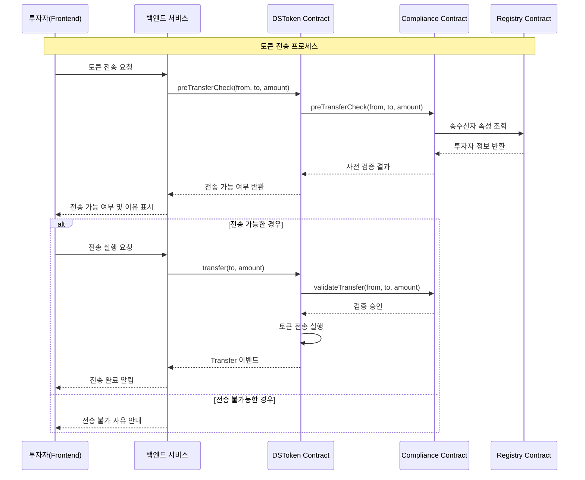

---

## 레이어별 상세 아키텍처

### Frontend Layer

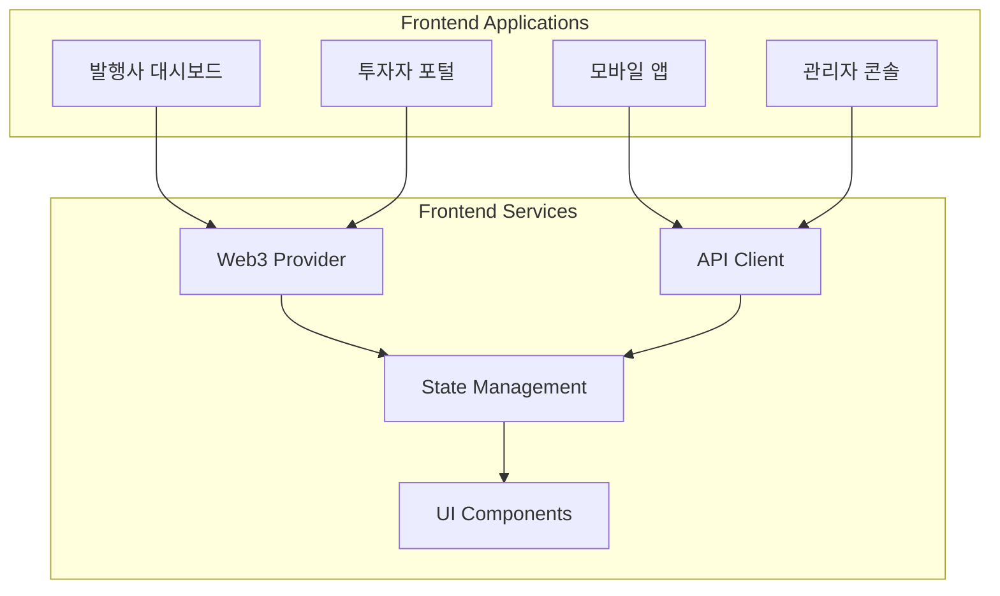

**주요 기능:**
- 발행사: 투자자 관리, 토큰 발행, 규제 보고
- 투자자: 투자 신청, 포트폴리오 조회, 토큰 전송
- 관리자: 시스템 모니터링, 규제 정책 관리

### Backend Layer

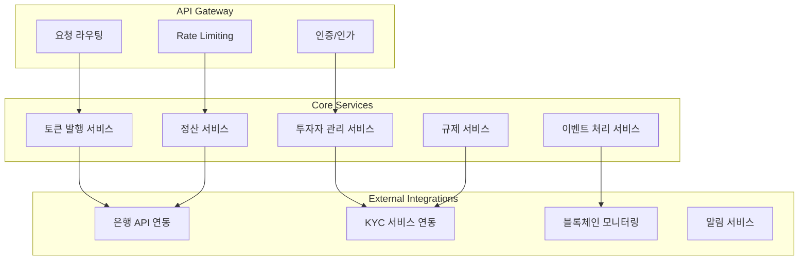

**주요 기능:**
- API 서버: RESTful API 제공
- 백오피스: 비즈니스 로직 처리
- 웹훅 처리: 외부 시스템 연동
- 이벤트 처리: 블록체인 이벤트 모니터링

### Contract Layer

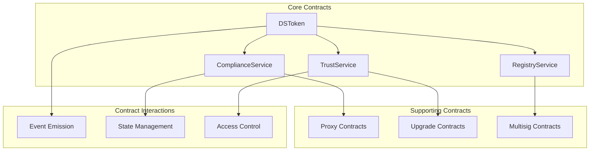

**주요 기능:**
- DSToken: ERC-20 기반 증권형 토큰
- ComplianceService: 규제 검증 로직
- TrustService: 역할 및 권한 관리
- RegistryService: 투자자 정보 관리

### Bank Layer

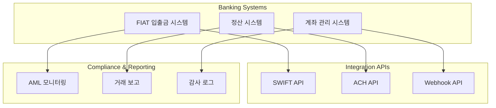

**주요 기능:**
- FIAT 입출금 처리
- 실시간 정산 확인
- 웹훅을 통한 입금 알림
- AML 및 규제 보고

### 국가기관 Layer

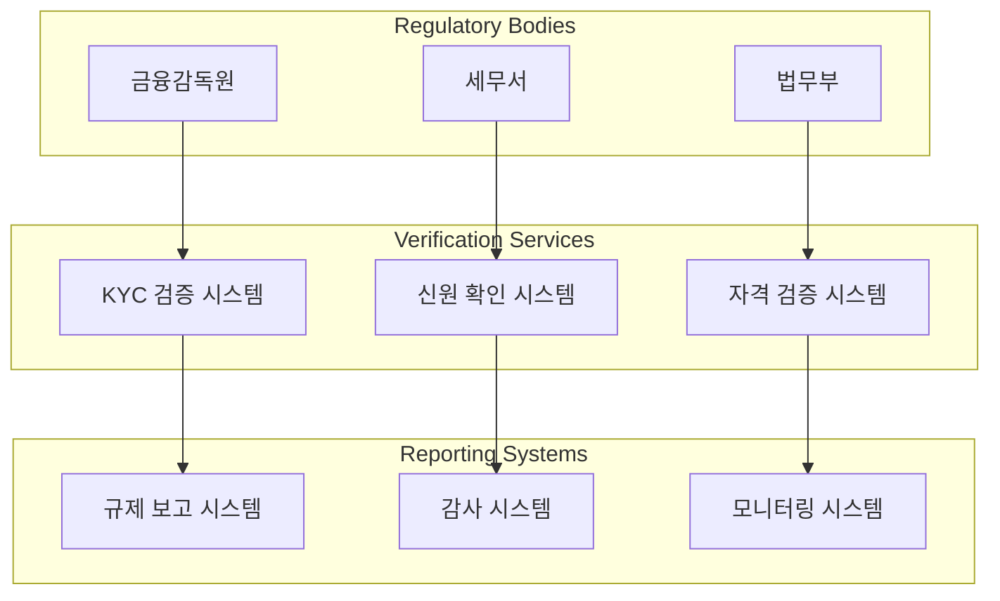

**주요 기능:**
- KYC/AML 검증
- 투자자 자격 확인
- 규제 보고서 수집
- 시스템 감사 및 모니터링

---

## 데이터 흐름 및 보안

### 데이터 흐름도

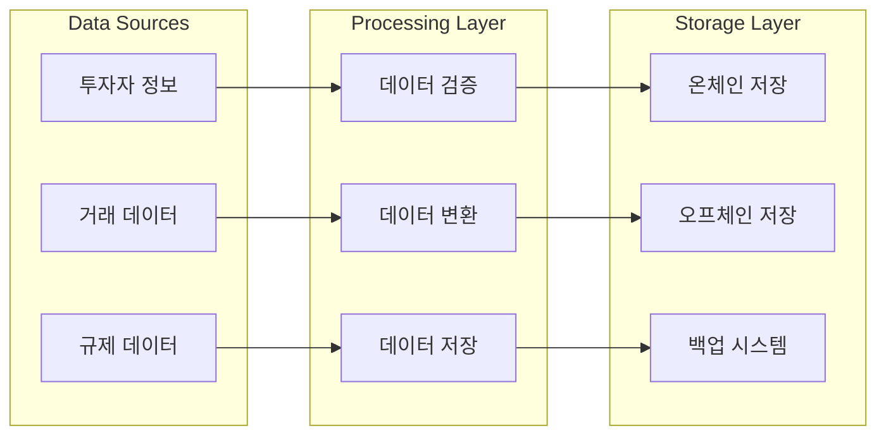

### 보안 아키텍처

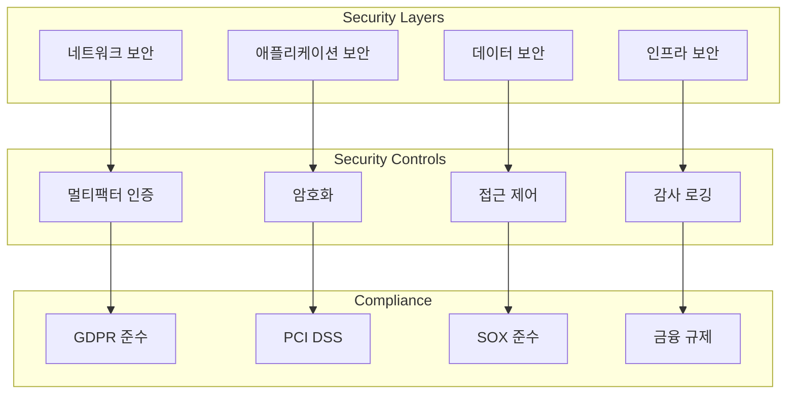

---

## 시스템 통합 및 확장성

### 마이크로서비스 아키텍처

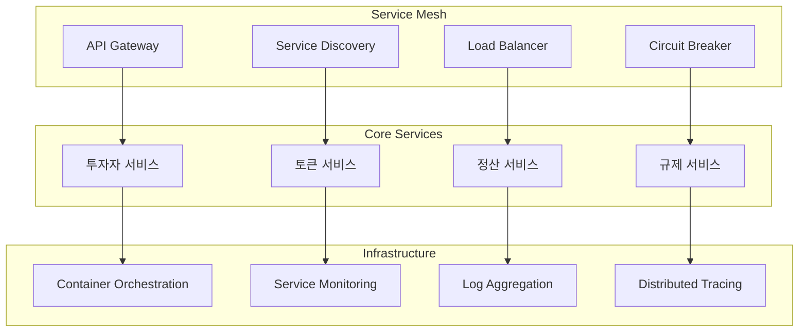

### 확장성 고려사항

1. **수평적 확장**: 마이크로서비스 기반 아키텍처로 독립적 스케일링
2. **데이터베이스 분할**: 투자자별, 지역별 샤딩
3. **캐싱 전략**: Redis를 활용한 고성능 데이터 캐싱
4. **비동기 처리**: 메시지 큐를 통한 이벤트 기반 아키텍처
5. **CDN 활용**: 정적 자원의 글로벌 배포

---

## 모니터링 및 운영

### 모니터링 아키텍처

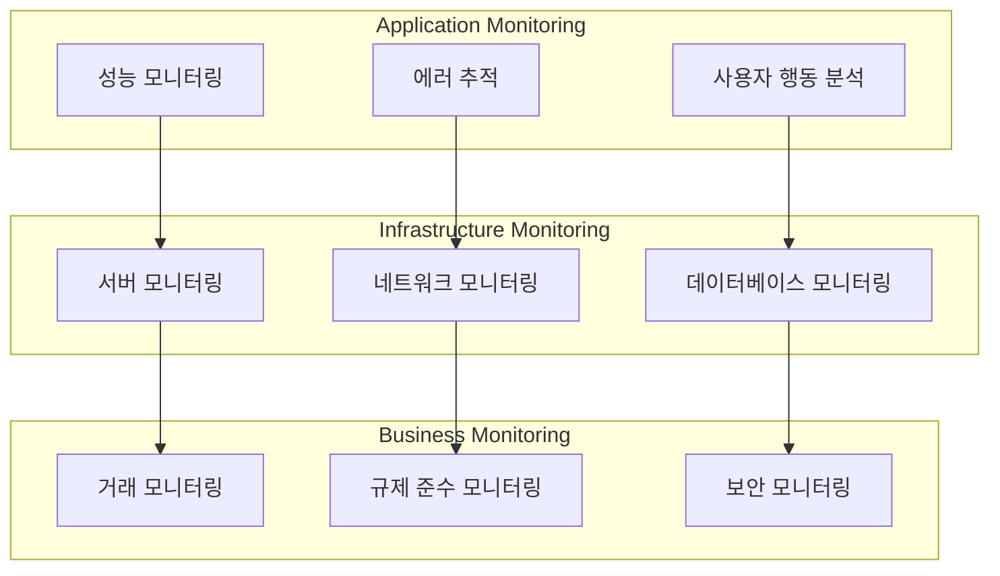

### 알림 및 대응 체계

1. **실시간 알림**: 중요 이벤트 발생 시 즉시 알림
2. **자동 복구**: 장애 발생 시 자동 복구 메커니즘
3. **백업 및 복구**: 정기적 백업 및 재해 복구 계획
4. **성능 최적화**: 지속적인 성능 모니터링 및 최적화

---

## 결론

본 아키텍처 문서는 DS Token 기반 RWA 서비스의 전체적인 구조와 각 레이어별 상세 기능을 발행사와 투자자 관점에서 설명했습니다. 

**핵심 특징:**
- **규제 준수**: ComplianceService를 통한 실시간 규제 검증
- **투명성**: 블록체인 기반의 투명한 거래 기록
- **확장성**: 마이크로서비스 기반의 확장 가능한 아키텍처
- **보안**: 다층 보안 체계를 통한 안전한 자산 관리
- **통합성**: 다양한 외부 시스템과의 원활한 연동

이 아키텍처는 금융 규제를 준수하면서도 효율적이고 안전한 RWA 서비스를 제공할 수 있도록 설계되었습니다.