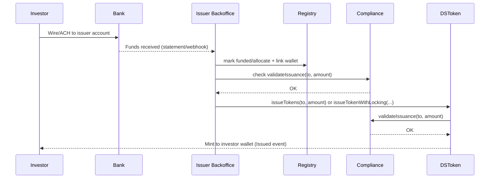
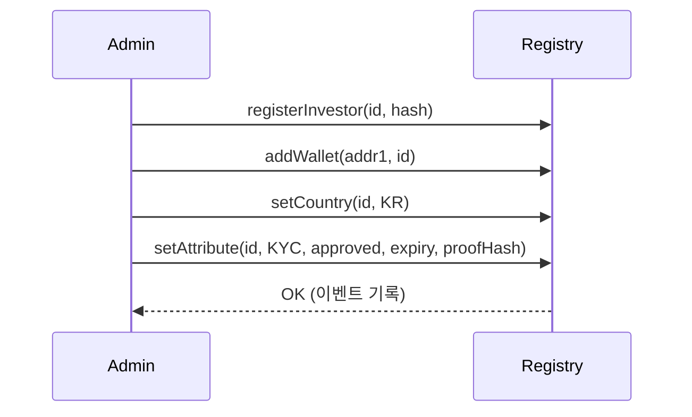
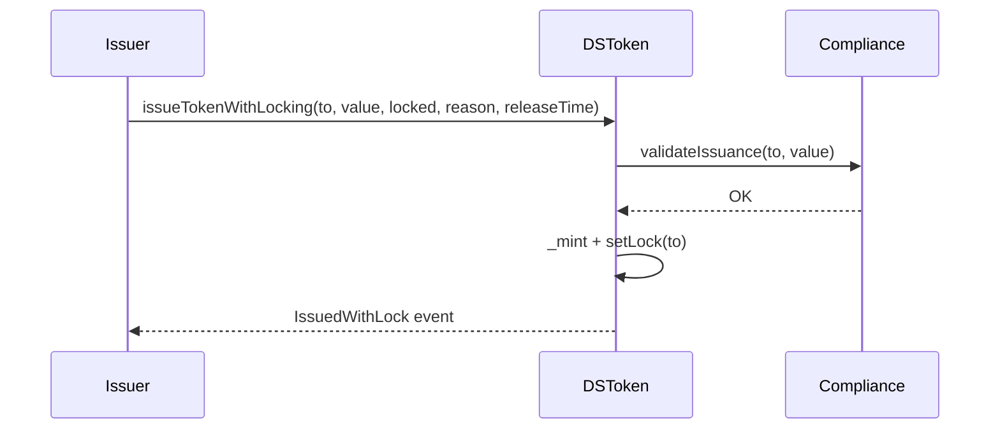
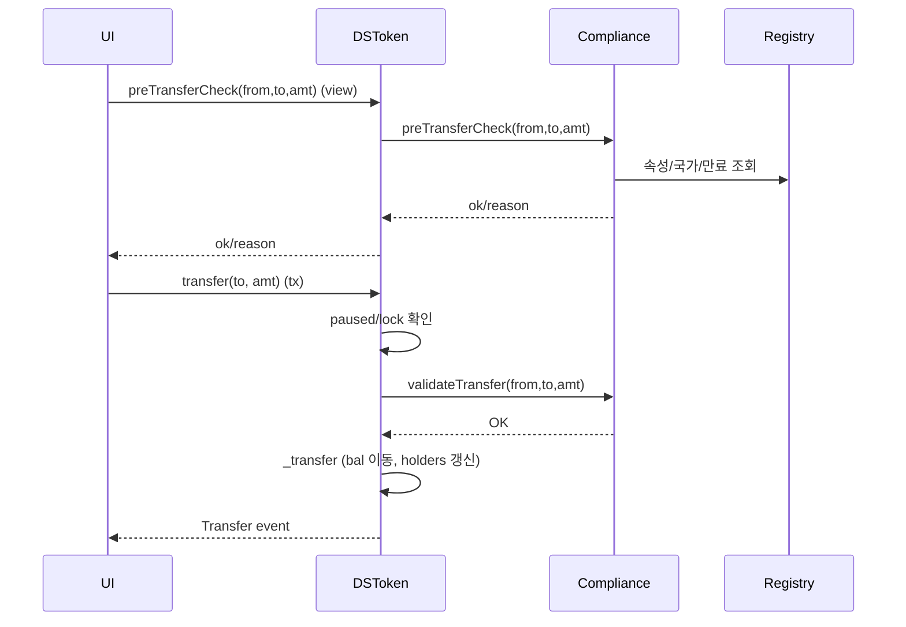
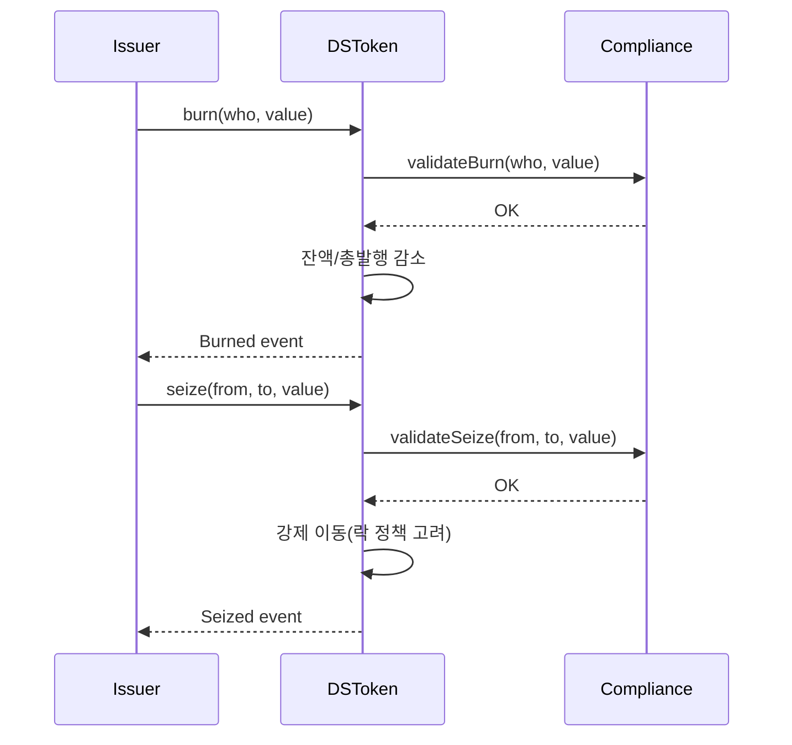
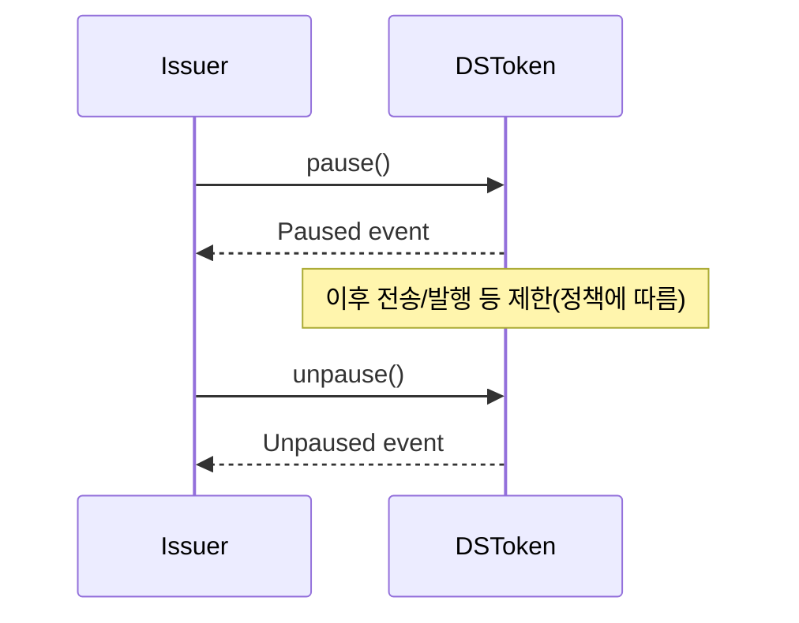
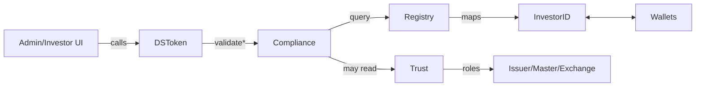
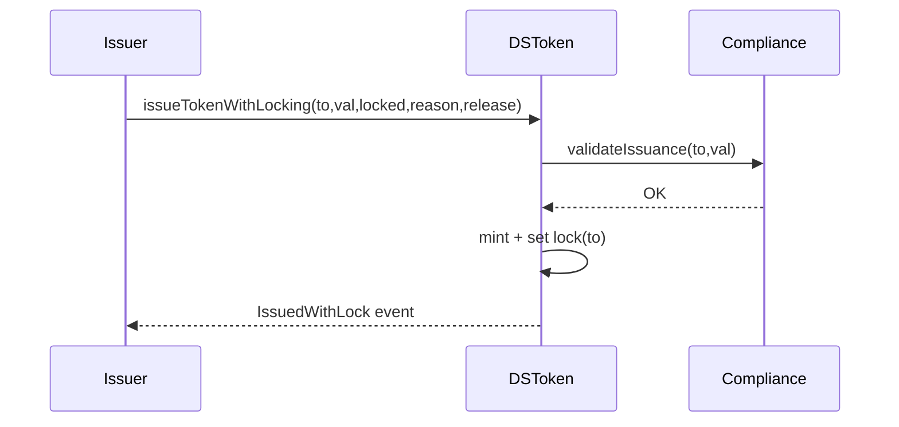
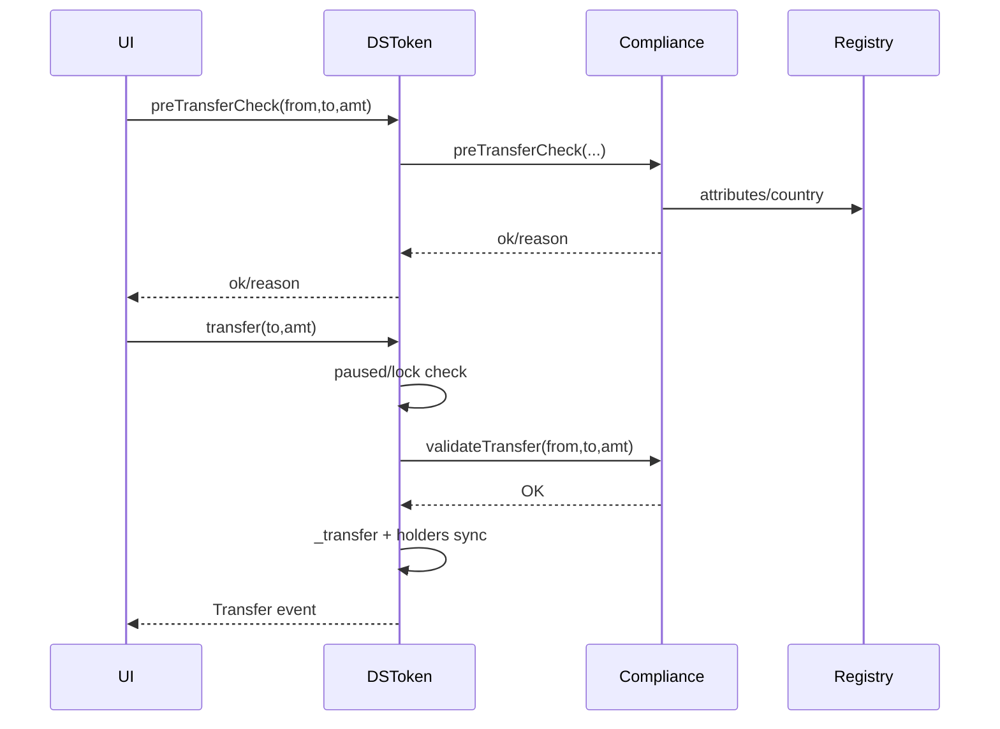
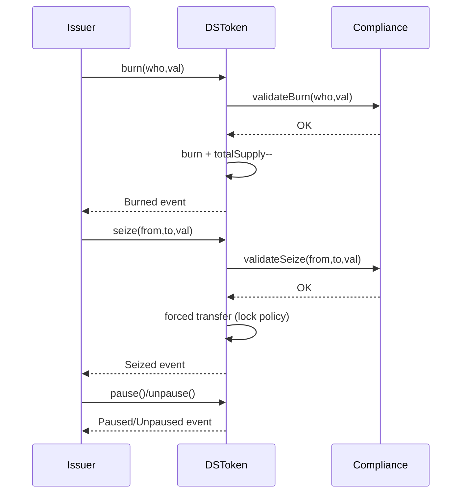

# 0) 한 장 요약

- **DSToken**: ERC-20에 **규제 훅**과 **관리 기능**(락/일시정지/강제회수/보유자열람 등)을 붙인 “증권형 토큰”.
- **ComplianceService**: “이 전송/발행/소각/회수가 **규칙에 맞는지**?”를 **최종 판단**.
- **TrustService**: “이 주소가 **발행사/마스터/거래소** 같은 **역할**을 가졌는지?”를 관리.
- **RegistryService**: “**투자자 ID ↔ 여러 지갑 주소**, 투자자 **속성(국가·KYC·자격)**”을 저장/조회.

> 핵심 아이디어: 토큰의 민감 동작(발행/전송/소각/회수)은 반드시 Compliance를 통과해야 한다.
>
>
> 권한이 필요한 동작은 **Trust**에서 **역할**을 확인한다. 규정 판단에 필요한 속성은 **Registry**에서 가져온다.
>

---

## 표준 흐름(오프체인 결제 → 온체인 발행)

1. **KYC/적격 확인 & 화이트리스트 등록**
    - 투자자 정보를 **RegistryService**에 등록(국가, KYC/적격, 지갑 주소 연결).
    - 이 단계가 통과되어야 **ComplianceService.validateIssuance**가 OK를 내립니다.
2. **구독 계약/청약 확정**
    - 금액, 락업(베스팅) 조건, 클로징 일정 확정.
3. **자금 입금(은행)**
    - 투자자가 **발행사(또는 에스크로/이관관리자) 계좌**로 USD 등 **FIAT 이체**.
    - “영수증 스크린샷”만 믿지 말고, **실제 입금 정산(수취 확인)**이 원칙입니다.
        - 보통 은행 웹훅/파일(ACH, SWIFT MT940 등)이나 백오피스 수기 대조로 **자금 정합성** 확인.
4. **정산 확인 → 온체인 발행 승인**
    - 백오피스가 “받은 돈=약정 금액”을 대조 → **Registry에 “funded/할당” 상태 기록**(속성/만료 포함).
    - 이제 **ComplianceService.validateIssuance(to, amount)** 가 **true**가 됩니다.
5. **토큰 발행(민팅)**
    - 발행사 주소(TrustService에서 `Issuer` 역할)가
        - `DSToken.issueTokens(to, amount)` 또는
        - `DSToken.issueTokenWithLocking(to, amount, locked, reason, releaseTime)` 호출.
    - 컨트랙트는 **Compliance.validateIssuance**를 다시 호출하여 최종 검증 후 **민팅**.
6. **완료 & 기록**
    - `Issued`/`IssuedWithLock` 이벤트, 내부 장부/규제 보고에 사용.
    - 이후 전송도 항상 **Compliance.validateTransfer**를 거칩니다.

> 포인트: *“증거를 발행사에 알려준다”*는 건 정산을 증명하는 보조자료일 뿐이고,
>
>
> **실제 토큰 발행은 ‘은행 입금이 확정’된 뒤**에 진행하는 게 표준입니다.
>

---

## 변형 시나리오(참고)

- **온체인 결제(DvP)**: USDC 등 **스테이블코인**으로 지불하고, **같은 트랜잭션에서 민팅**(원자결제)하도록 설계할 수도 있어요. 이 경우에도 **KYC/화이트리스트 선행**은 그대로 필요합니다.
- **에스크로/대리인**: 법규상 **이관관리자/Transfer Agent**가 발행/이관을 집행하기도 합니다.
- **락업/국가 제한**: 발행 시 `issueTokenWithLocking`으로 락 설정, Compliance는 국가/자격/보유자 상한을 강제.

---

## 간단 흐름도



---

## 실패/보류되는 대표 케이스

- KYC/적격 미승인, 국가 제한 위반 → **Compliance 거부**
- 은행 **미정산/금액 불일치** → 발행 보류
- 지갑이 **화이트리스트 미등록** → 발행 거부
- 라운드 캡/보유자 상한 초과 → 거부 또는 부분 할당

---

## 한 줄 정리

**맞습니다.** 실무에선 **은행 정산 확인 → Registry 상태 갱신 → Compliance 승인 → 민팅** 순으로 진행합니다.

단, *“증거 제출”만으로 민팅하는 게 아니라*, **실제 자금 도착을 백오피스가 확인**한 뒤 온체인 발행이 이뤄집니다.

# 스마트컨트랙트 설명

# 1) 구성 요소별 역할(자세히)

## A. DSToken (ERC-20 확장)

**무엇을 하나?**

- 기본 ERC-20(잔액/허용량/전송) + **발행(issue)**, **락(vesting)**, **소각(burn)**, **강제회수(seize)**, **일시정지(pause)**, **보유자 열람**.
- 모든 민감 동작은 먼저 **ComplianceService**에 물어보고, **TrustService** 역할 검사를 통과해야 한다.

**왜 필요한가?**

- “아무나/아무 때나” 전송하면 규제 위반이 될 수 있음 → **Compliance**가 **게이트** 역할.
- 분실·사고 대응, 배당·감사 같은 증권 업무 → **발행사 전용 기능** 필요.

---

## B. ComplianceService (규제 검증)

**무엇을 하나?**

- `validate*` 계열로 **트랜잭션 중에 강제** 검증(불일치면 revert).
- `pre*Check` 계열로 **사전(뷰) 확인**(가스 낭비 방지, UI 피드백).

**정책 예시**

- **화이트리스트 모드**: “레지스트리에 등록된 지갑만 가능”.
- **규제형 모드**: 국가 제한, 적격 투자자만, 보유자 상한(N명), 락/쿨다운 등 **복합 규칙**.

---

## C. TrustService (역할/권한)

**무엇을 하나?**

- 주소에 **역할(Role)** 부여·조회(예: None=0, Master=1, Issuer=2, Exchange=4).
- DSToken은 민감 함수에서 “호출자가 발행사/마스터 맞나?”를 여기서 확인.

---

## D. RegistryService (투자자/속성)

**무엇을 하나?**

- **투자자 ID ↔ 여러 지갑 주소** 연결.
- **국가/적격/KYC/만료일/증빙 해시** 등 **속성** 저장.
- Compliance는 규정 판단 시 이 정보를 사용.

---

# 2) DSToken: 함수별 “말 설명” (전제·반환·실패)

### 2.1 전송(transfer / transferFrom)

- **전제**
    - 토큰이 **일시정지 아님**.
    - 보내는 사람의 **사용 가능 잔액**(= 잔액 − 잠금분)이 **충분**.
    - **Compliance.validateTransfer(from, to, amount)** 가 **true**(규정 OK).
- **무엇을 함**
    - 위 조건을 통과하면 잔액을 이동하고 `Transfer` 이벤트를 기록.
    - 보유자 목록(잔고>0 주소 목록)을 업데이트.
- **반환**
    - 성공 시 `true`.
- **실패(대표)**
    - 정지 중(`Paused`), 잔액 부족, **Locked balance**(베스팅 잠금), **규정 불일치**(예: 허용되지 않은 국가/미등록 주소).

> Tip: 전송 전에 preTransferCheck(from,to,amt) 를 UI에서 호출해 “가능/불가능”을 미리 보여주면 가스 낭비를 줄임.
>

---

### 2.2 발행(issueTokens / issueTokenWithLocking)

- **전제**
    - 호출자는 **발행사/마스터 역할**(TrustService 확인).
    - **Compliance.preIssuanceCheck**(선택)과 **Compliance.validateIssuance**(필수) 통과.
    - 락 발행일 경우, **락 수량 ≤ 발행 후 잔액**.
- **무엇을 함**
    - 총발행량 증가, 수취인 잔액 증가, 필요시 **락(금액/해제시점/사유)** 기록.
- **반환**
    - 성공 시 `true` + `Issued` 또는 `IssuedWithLock` 이벤트.
- **실패(대표)**
    - 권한 없음, 규정 불일치, 락 수량 과다 등.

> 용례: 초기 분배(프라이빗 세일), 베스팅(팀 할당), 규제 대응형 발행(국가 제한 등).
>

---

### 2.3 소각(burn)

- **전제**
    - 호출자는 **발행사/마스터**.
    - **Compliance.validateBurn(who, value)** 통과.
    - 대상 잔액 충분.
- **무엇을 함**
    - 대상 잔액과 총발행량 감소, `Burned` 이벤트.
- **실패**
    - 권한 없음, 규정 불일치, 잔액 부족.

> 용례: 환매/무효화/취소.
>

---

### 2.4 강제회수(seize)

- **전제**
    - 호출자는 **발행사/마스터**.
    - **Compliance.validateSeize(from, to, value)** 통과.
    - `from` 잔액 충분, 정책에 따라 **락 무시/적용** 결정(예제는 적용).
- **무엇을 함**
    - `from → to` 강제 이동, `Seized` 이벤트.
- **실패**
    - 권한 없음, 규정 불일치, 잔액 부족/락.

> 용례: 지갑 분실/사고, 법적 명령에 따른 이전.
>

---

### 2.5 일시정지(pause/unpause)

- **전제**
    - 호출자는 **발행사/마스터**.
- **무엇을 함**
    - `pause()` 시 **모든 전송**(발행/소각/회수 포함 여부는 정책에 따라) **차단**.
    - `unpause()` 시 재개.

> 용례: 보안 사고/법령 변경/긴급 대응.
>

---

### 2.6 보유자 열람(walletCount/getWalletAt)

- **무엇을 함**
    - 잔액>0 주소 목록을 **온체인에서 열람**(감사/배당 등).
- **주의**
    - **가스 비용**. 보유자 수가 커지면 온체인 순회가 비싸짐 → **오프체인 인덱싱** 병행 권장.

---

### 2.7 투자자 중심 잔액 조회(balanceOfInvestor)

- **무엇을 함**
    - 레지스트리에서 투자자의 **모든 지갑 주소**를 가져와 **합산 잔액**을 반환.
- **왜 필요?**
    - “한 투자자=여러 지갑”인 현실을 반영, **규제(보유자 수 제한)** 나 **배당**에 유용.

---

### 2.8 사전 체크(preTransferCheck)

- **무엇을 함**
    - 토큰 자체 정책(정지/락) + **Compliance.preTransferCheck** 결과를 반환.
    - **뷰 함수**라 가스 소모 없이 가능/불가와 이유를 보여주기 좋음.
- **UI 예시**

    ```tsx
    const { ok, reason } = await token.preTransferCheck(from, to, amt);
    if (!ok) showToast(`전송 불가: ${reason}`);
    else enableSubmit();
    
    ```


---

# 3) ComplianceService: 정책을 “말로” 설계하기

**공통 입력**: `(from, to, value)` 혹은 `(to, value)`/`(who, value)`

**참고 데이터**:

- 레지스트리: `wallet → investorId → {country, attributes(KYC/acc/qualified/professional, expiry...), linked wallets}`
- (선택) 트러스트: 특정 역할에 대한 예외/완화.
- 자체 상태: 국가 허용 테이블, 보유자 상한, 주소 블랙리스트, 쿨다운, 최소보유/최대거래 한도 등.

**판단 로직(예시)**

1. **화이트리스트 모드**
    - `from`, `to` 모두 레지스트리 등록? 아니면 거부.
    - 만료된 속성/정책 불일치(예: KYC 미승인)면 거부.
2. **규제형 모드(룰엔진)**
    - 국가 허용/차단(`getCountryCompliance`).
    - 적격 요건(예: accredited only).
    - 2차 거래 제한(락 완료 후 n일).
    - 보유자 수 상한(예: 200명 규정) → **투자자 기준**으로 카운팅.
    - 대량 거래 한도/일일 한도.
    - 거래소/발행사 특례.

**반환**: `(ok: bool, reason: string)`

**사전 체크**: 같은 로직을 **view**로 제공해 “불가 사유”를 미리 UI에 노출.

---

# 4) TrustService: 역할/권한

- `setRole(addr, role)`
    - 관리자가 주소에 역할 부여/변경.
    - 이벤트 기록(감사).
- `roleOf(addr) → uint256`
    - DSToken 등에서 **민감 함수** 전 권한 확인.

> 운영 체계: 멀티시그/타임락/거버넌스로 setRole을 보호(오남용 방지).
>

---

# 5) RegistryService: 투자자/속성

- `registerInvestor(id, collisionHash)`
    - ID 중복 방지, 이벤트 로깅.
- `addWallet(addr, id)`
    - 투자자 한 명이 **여러 지갑**을 연결.
- `setCountry(id, country)`
    - ISO 국가 코드 등.
- `setAttribute(id, attrId, value, expiry, proofHash)`
    - 예: `attrId` → none(0), kyc(1), accredited(2), qualified(4), professional(8) 등
    - `value` → pending/approved/rejected
    - `proofHash` → 오프체인 문서 해시(KYC 리포트 등), 필요시 제출 검증.

> 개인정보는 온체인에 직접 저장하지 않음(이름/주민번호는 오프체인). 온체인은 속성/해시/만료만.
>

---

# 6) 대표 시나리오

## 6.1 투자자 온보딩 & 등록

- **오프체인**: 투자자 KYC 완료 → 결과/만료일/증빙해시 확보.
- **온체인**:
    1. `registerInvestor(id, collisionHash)`
    2. `addWallet(addr1, id), addWallet(addr2, id) ...`
    3. `setCountry(id, "KR")`
    4. `setAttribute(id, KYC, approved, expiryDate, proofHash)`
    5. (필요시) `setAttribute(id, accredited, approved, ...)`



---

## 6.2 발행(락 포함)

- 발행사(또는 마스터)가 **락 조건 포함** 발행을 수행.
- 전제: 발행사 역할, compliance OK.



---

## 6.3 전송(사전 체크 + 실제 전송)

- UI에서 사전 체크로 “가능/이유” 확인 → 제출 버튼 활성화.
- 실제 전송은 동일 로직을 **트랜잭션 경로**에서 다시 검증.



---

## 6.4 소각/강제회수



---

## 6.5 글로벌 일시정지



---

# 7) 엣지 케이스 & 운영 팁

- **락(베스팅)**: 실무는 **다중 락**(기간/수량 여러 개) 필요. 조회/차감 로직을 **가스 효율** 있게 설계(예: 누적합·이진탐색).
- **보유자 목록**: 온체인 유지 시 **insert/remove 비용** 존재. 보유자 수가 커지면 **오프체인 인덱싱** 필수.
- **규정 변경**: Compliance 정책 변경은 **이벤트 로깅**과 **버전 관리**. 과거 트랜잭션과의 호환성 주의.
- **권한 변경**: Trust `setRole`은 멀티시그/타임락으로 **거버넌스** 강화.
- **업그레이드**: UUPS/Beacon 등을 검토. 증권 토큰 특성상 **불변성/감사** 요구가 높음 → 업그레이드 권한을 매우 보수적으로 관리.
- **개인정보**: 온체인엔 **속성/해시/만료**만. 원문은 오프체인 저장(규제기관 요청 시 해시 대조).

---

# 8) 테스트 체크리스트(초보자용 가이드)

- **Happy path**
    - 등록된 투자자에게 발행/락 → 락 기간 내 전송 거부, 해제 후 허용.
    - 허용 국가/속성에서 전송 OK, 차단 국가는 거부.
- **에러 케이스**
    - **미등록 지갑** 전송/발행 거부.
    - **일시정지** 중 전송/발행/회수 거부(정책에 따라).
    - **보유자 상한** 초과 시 거부(규제형 모드).
    - **속성 만료**(expiry 지난 KYC/자격) 시 거부.
- **권한**
    - 일반 주소가 `issue/burn/seize/pause` 호출 시 **revert**.
- **이벤트**
    - `Issued/WithLock/Burned/Seized/Paused/Unpaused/Transfer`가 올바른 파라미터로 발생.

> Fuzz: transfer 입력(양수/음수·오버플로는 0.8.x 자동 방지) 랜덤화, 보유자 목록 정확성 불변식 확인.
>
>
> **Property**: “총 잔액 합 = totalSupply”, “잠금 고려 시 spendable ≥ 0”, “역할 없는 호출자 = revert”.
>

---

# 9) 가스/스케일

- **합리적 선에서 온체인, 나머진 오프체인**: 보유자 풀스캔/대량 배당 계산은 인덱서/서버에서.
- **정책 캐시**: Compliance가 자주 쓰는 정책(국가 허용 등)은 **매핑 조회 O(1)** 로.
- **배치 작업**: 다수 발행/업데이트는 **배치 트랜잭션** 또는 **멀티콜** 고려.

---

# 10) 실전 통합(오프체인과 연결)

- **어드민 대시보드**: 투자자 등록/속성 업데이트/발행/락 관리 UI.

  변경은 모두 **온체인 호출 + 이벤트**로 남겨 **감사 흔적** 확보.

- **KYC 공급자 연동**: 외부 API에서 결과 수신 → 오프체인 저장 → 온체인엔 `setAttribute(..., proofHash)` 만 기록.
- **거래소(RFE) 연동**: 거래소가 **등록된 투자자로만** 예치/출금할 수 있게 오프체인과 온체인 정책 일치.

---

# 11) 초보자를 위한 비유

- **DSToken** = 은행의 “예금 원장 + 규정 체크 게이트”가 붙은 계좌.
- **Compliance** = 창구의 규정 담당자(“이 거래 합법?”)
- **Trust** = 직원 직책표(“발행/회수 권한 있는 사람?”)
- **Registry** = 고객 파일(“국적/자격/지갑 목록은?”)

---

# 12) 페이지/흐름도 모음

## 12.1 시스템 전반



## 12.2 발행(락 포함)



## 12.3 전송(사전 체크 → 실제)



## 12.4 소각/강제회수/정지



```solidity
// SPDX-License-Identifier: MIT
pragma solidity ^0.8.24; // ^0.8.x 사용(언더플로/오버플로 자동 검출)

// ------------------------------
// 인터페이스: 트러스트/레지스트리/컴플라이언스
// ------------------------------
interface ITrustService {
    // 지갑의 역할(Role) 질의: 0=None, 1=Master, 2=Issuer, 4=Exchange (예시)
    function roleOf(address wallet) external view returns (uint256);
}

interface IRegistryService {
    // 투자자 ID -> 보유 지갑 목록을 리턴(예시 시그니처)
    function walletsOf(string calldata investorId) external view returns (address[] memory);
}

interface IComplianceService {
    // 사전 확인용(가스 낭비 방지) 뷰 함수들
    function preIssuanceCheck(address to, uint256 value) external view returns (bool ok, string memory reason);
    function preTransferCheck(address from, address to, uint256 value) external view returns (bool ok, string memory reason);

    // 실제 트랜잭션 경로에서 호출되는 검증 함수들(위반 시 false 리턴 또는 토큰 쪽에서 revert)
    function validateIssuance(address to, uint256 value) external returns (bool ok, string memory reason);
    function validateBurn(address who, uint256 value) external returns (bool ok, string memory reason);
    function validateSeize(address from, address to, uint256 value) external returns (bool ok, string memory reason);
    function validateTransfer(address from, address to, uint256 value) external returns (bool ok, string memory reason);

    // 규제형/화이트리스트 모드 등 내부 정책은 컴플라이언스 컨트랙트가 판단
}

// ------------------------------
// DS 토큰(간단 ERC20 + 확장)
// ------------------------------
contract DSToken {
    // ----- ERC20 기본 필드 -----
    string public name;                 // 토큰 이름
    string public symbol;               // 토큰 심볼
    uint8  public immutable decimals;   // 소수 자리(대개 18)
    uint256 public totalSupply;         // 총 발행량

    // 잔액 및 허용량(ERC20 표준)
    mapping(address => uint256) private _balances;                     // 각 주소 잔액
    mapping(address => mapping(address => uint256)) private _allowances; // owner->spender 허용량

    // ----- DS 확장: 외부 서비스 -----
    ITrustService public trust;         // 트러스트(역할 관리)
    IRegistryService public registry;   // 레지스트리(투자자/지갑 매핑)
    IComplianceService public compliance; // 컴플라이언스(규제 검증)

    // ----- DS 확장: 보유자 목록/카운트 -----
    address[] private _holders;         // 현재 보유자 주소 배열(0보다 큰 잔액)
    mapping(address => bool) private _isHolder; // 보유자 여부 캐시

    // ----- DS 확장: 락킹(간단 버전) -----
    struct LockInfo {                   // 한 주소에 대한 단일 락 예제(단순화)
        uint256 amountLocked;           // 잠겨있는 수량
        uint64  releaseTime;            // 잠금 해제 시각(Unix time)
        string  reason;                 // 락 사유(옵션)
    }
    mapping(address => LockInfo) private _locks; // 주소별 락 정보(단일)

    // ----- DS 확장: 상태 -----
    bool private _paused;               // 전송 일시정지 플래그
    uint256 public totalIssued;         // 누적 발행량(재발행/소각 관계없이 "발행" 카운트 개념)

    // ----- 상수/역할 식별 -----
    uint256 private constant ROLE_NONE    = 0; // 없음
    uint256 private constant ROLE_MASTER  = 1; // 마스터(최상위 권한, 예시)
    uint256 private constant ROLE_ISSUER  = 2; // 발행사
    uint256 private constant ROLE_EXCHANGE= 4; // 거래소(예: 특수 권한이 필요할 때)

    // ----- 이벤트 -----
    event Transfer(address indexed from, address indexed to, uint256 value); // ERC20 Transfer
    event Approval(address indexed owner, address indexed spender, uint256 value); // ERC20 Approval
    event Paused(address indexed by);    // 전송 일시정지
    event Unpaused(address indexed by);  // 전송 재개
    event Issued(address indexed to, uint256 value); // 발행 이벤트
    event IssuedWithLock(address indexed to, uint256 minted, uint256 locked, uint64 releaseTime, string reason); // 락 발행
    event Burned(address indexed who, uint256 value, string reason); // 소각
    event Seized(address indexed from, address indexed to, uint256 value, string reason); // 강제 회수

    // ----- 생성자 -----
    constructor(
        string memory _name,            // 초기 토큰 이름
        string memory _symbol,          // 초기 토큰 심볼
        uint8 _decimals,                // 소수 자리
        address _trust,                 // 트러스트 서비스 주소
        address _registry,              // 레지스트리 서비스 주소
        address _compliance             // 컴플라이언스 서비스 주소
    ) {
        name = _name;                   // 이름 설정
        symbol = _symbol;               // 심볼 설정
        decimals = _decimals;           // 소수 자리 설정(immutable)
        trust = ITrustService(_trust);  // 트러스트 바인딩
        registry = IRegistryService(_registry); // 레지스트리 바인딩
        compliance = IComplianceService(_compliance); // 컴플라이언스 바인딩
    }

    // ------------------------------
    // 접근 제어(트러스트 역할 기반)
    // ------------------------------
    modifier onlyIssuerOrMaster() {
        // 호출자 역할 확인(발행/소각/정지 등 민감 기능 보호)
        uint256 r = trust.roleOf(msg.sender);
        require(r == ROLE_ISSUER || r == ROLE_MASTER, "Not issuer/master");
        _;
    }

    // ------------------------------
    // 전송 가드(canTransfer): 컴플라이언스 검증 + 정지/락 확인
    // ------------------------------
    modifier canTransfer(address from, address to, uint256 amount) {
        // 글로벌 일시정지 여부
        require(!_paused, "Transfers paused");

        // 락(베스팅) 확인: from 의 사용가능 잔액이 충분한지
        // (단순 모델: 잠겨있는 수량은 releaseTime 전까지 사용 불가)
        LockInfo memory L = _locks[from];
        if (L.amountLocked > 0 && block.timestamp < L.releaseTime) {
            // 사용 가능 잔액 = 잔액 - 잠금수량
            uint256 spendable = _balances[from] - L.amountLocked;
            require(amount <= spendable, "Locked balance");
        }

        // 컴플라이언스 실검증(트랜잭션 경로에서 호출되는 함수)
        (bool ok, string memory reason) = compliance.validateTransfer(from, to, amount);
        require(ok, reason);

        _;
    }

    // ------------------------------
    // ERC20 표준 뼈대
    // ------------------------------
    function balanceOf(address account) public view returns (uint256) {
        return _balances[account]; // 잔액 조회
    }

    function allowance(address owner, address spender) public view returns (uint256) {
        return _allowances[owner][spender]; // 허용량 조회
    }

    function approve(address spender, uint256 amount) public returns (bool) {
        _approve(msg.sender, spender, amount); // 허용량 설정
        return true;
    }

    function transfer(address to, uint256 amount) public canTransfer(msg.sender, to, amount) returns (bool) {
        _transfer(msg.sender, to, amount); // 전송
        return true;
    }

    function transferFrom(address from, address to, uint256 amount) public canTransfer(from, to, amount) returns (bool) {
        uint256 current = _allowances[from][msg.sender]; // 현재 허용량
        require(current >= amount, "Insufficient allowance"); // 허용량 체크
        unchecked { _approve(from, msg.sender, current - amount); } // 사용만큼 차감
        _transfer(from, to, amount); // 전송
        return true;
    }

    // 내부 전송 로직: 보유자 목록 갱신 포함
    function _transfer(address from, address to, uint256 amount) internal {
        require(to != address(0), "Zero to"); // 제로 주소 금지
        uint256 fromBal = _balances[from];    // from 잔액
        require(fromBal >= amount, "Balance"); // 잔액 충분성
        unchecked {
            _balances[from] = fromBal - amount; // 차감
            _balances[to] += amount;            // 증가
        }
        _syncHoldersOnDecrease(from);          // 보유자 목록 갱신(from)
        _syncHoldersOnIncrease(to);            // 보유자 목록 갱신(to)
        emit Transfer(from, to, amount);       // 이벤트
    }

    // 내부 승인 로직
    function _approve(address owner, address spender, uint256 amount) internal {
        require(owner != address(0) && spender != address(0), "Zero addr");
        _allowances[owner][spender] = amount; // 허용량 설정
        emit Approval(owner, spender, amount); // 이벤트
    }

    // ------------------------------
    // 발행(issuer 전용)
    // ------------------------------
    function issueTokens(address to, uint256 value) external onlyIssuerOrMaster returns (bool) {
        // 사전 및 본 검증: 컴플라이언스
        (bool preOk, ) = compliance.preIssuanceCheck(to, value);
        require(preOk, "Pre-issuance blocked");
        (bool ok, string memory reason) = compliance.validateIssuance(to, value);
        require(ok, reason);

        _mint(to, value);               // 민트
        totalIssued += value;           // 누적 발행량 카운트
        emit Issued(to, value);         // 이벤트
        return true;
    }

    // 락과 함께 발행(간단 버전: 기존 락을 덮어씀)
    function issueTokenWithLocking(
        address to,
        uint256 value,
        uint256 valueLocked,
        string calldata reason,
        uint64 releaseTime
    ) external onlyIssuerOrMaster returns (bool) {
        // 기본 발행과 동일한 검증 수행
        (bool preOk, ) = compliance.preIssuanceCheck(to, value);
        require(preOk, "Pre-issuance blocked");
        (bool ok, string memory why) = compliance.validateIssuance(to, value);
        require(ok, why);

        _mint(to, value);               // 민트
        totalIssued += value;           // 누적 발행 증가

        // 락 세팅(단순 모델: 1건만 저장, 실전은 다중 락/증분 설계 권장)
        if (valueLocked > 0) {
            require(valueLocked <= _balances[to], "Lock > balance");
            _locks[to] = LockInfo({
                amountLocked: valueLocked,
                releaseTime: releaseTime,
                reason: reason
            });
        }

        emit IssuedWithLock(to, value, valueLocked, releaseTime, reason); // 이벤트
        return true;
    }

    // 내부 민트
    function _mint(address to, uint256 value) internal {
        require(to != address(0), "Zero to");
        totalSupply += value;           // 총발행 증가
        _balances[to] += value;         // 잔액 증가
        _syncHoldersOnIncrease(to);     // 보유자 목록 갱신
        emit Transfer(address(0), to, value); // ERC20 규약 이벤트
    }

    // ------------------------------
    // 소각/강제회수(issuer 전용)
    // ------------------------------
    function burn(address who, uint256 value, string calldata reason)
        external
        onlyIssuerOrMaster
        returns (bool)
    {
        // 컴플라이언스 검증
        (bool ok, string memory why) = compliance.validateBurn(who, value);
        require(ok, why);

        uint256 bal = _balances[who];   // 대상 잔액
        require(bal >= value, "Balance");
        unchecked { _balances[who] = bal - value; } // 차감
        totalSupply -= value;           // 총발행 감소
        _syncHoldersOnDecrease(who);    // 보유자 목록 갱신
        emit Burned(who, value, reason);// 커스텀 이벤트
        emit Transfer(who, address(0), value); // ERC20 이벤트
        return true;
    }

    function seize(address from, address to, uint256 value, string calldata reason)
        external
        onlyIssuerOrMaster
        returns (bool)
    {
        // 컴플라이언스 검증(강제 회수/이관)
        (bool ok, string memory why) = compliance.validateSeize(from, to, value);
        require(ok, why);

        require(to != address(0), "Zero to"); // 유효성
        uint256 bal = _balances[from];        // from 잔액
        require(bal >= value, "Balance");     // 충분성

        // 락 고려: from 의 spendable 체크(정책에 따라 강제회수는 락 무시도 가능하지만 예제에선 체크)
        LockInfo memory L = _locks[from];
        if (L.amountLocked > 0 && block.timestamp < L.releaseTime) {
            uint256 spendable = bal - L.amountLocked;
            require(value <= spendable, "Locked balance");
        }

        unchecked { _balances[from] = bal - value; } // 차감
        _balances[to] += value;                      // 증가
        _syncHoldersOnDecrease(from);                // 보유자 목록 갱신
        _syncHoldersOnIncrease(to);                  // 보유자 목록 갱신
        emit Seized(from, to, value, reason);        // 커스텀 이벤트
        emit Transfer(from, to, value);              // ERC20 이벤트
        return true;
    }

    // ------------------------------
    // 일시정지 제어(issuer/master)
    // ------------------------------
    function pause() external onlyIssuerOrMaster {
        _paused = true;                 // 정지
        emit Paused(msg.sender);        // 이벤트
    }

    function unpause() external onlyIssuerOrMaster {
        _paused = false;                // 재개
        emit Unpaused(msg.sender);      // 이벤트
    }

    function isPaused() external view returns (bool) {
        return _paused;                 // 외부에서 상태 조회
    }

    // ------------------------------
    // 보유자 열람(감사/배당 등)
    // ------------------------------
    function walletCount() external view returns (uint256) {
        return _holders.length;         // 현재 보유자 수
    }

    function getWalletAt(uint256 index) external view returns (address) {
        require(index < _holders.length, "OOB"); // 범위 체크
        return _holders[index];         // 인덱스 위치의 보유자 주소
    }

    // ------------------------------
    // 투자자 중심 조회(레지스트리 연동)
    // ------------------------------
    function balanceOfInvestor(string calldata investorId) external view returns (uint256 total) {
        // 레지스트리에서 해당 투자자가 소유한 모든 지갑 배열을 가져온다
        address[] memory ws = registry.walletsOf(investorId);
        // 각 지갑 잔액을 합산
        for (uint256 i = 0; i < ws.length; i++) {
            total += _balances[ws[i]];
        }
    }

    // ------------------------------
    // 사전 체크 포워더(프론트/백엔드용 가스 절약)
    // ------------------------------
    function preTransferCheck(address from, address to, uint256 value) external view returns (bool ok, string memory reason) {
        // DS 토큰 내부 정책(정지/락 등)까지 고려하려면 토큰 쪽도 확인
        if (_paused) return (false, "Paused");        // 정지 중
        LockInfo memory L = _locks[from];
        if (L.amountLocked > 0 && block.timestamp < L.releaseTime) {
            uint256 spendable = _balances[from] - L.amountLocked;
            if (value > spendable) return (false, "Locked balance");
        }
        // 컴플라이언스 사전 체크 위임
        return compliance.preTransferCheck(from, to, value);
    }

    // ------------------------------
    // 내부 유틸: 보유자 배열 동기화
    // ------------------------------
    function _syncHoldersOnIncrease(address a) internal {
        // 잔액 증가 후 처음 0->양수로 바뀌었으면 목록에 추가
        if (!_isHolder[a] && _balances[a] > 0) {
            _isHolder[a] = true;
            _holders.push(a);
        }
    }

    function _syncHoldersOnDecrease(address a) internal {
        // 잔액 감소 후 0이 되면 목록에서 제거(간단 구현: 스왑-팝)
        if (_isHolder[a] && _balances[a] == 0) {
            _isHolder[a] = false;
            // 배열에서 a 찾기(선형 탐색: 간단 구현)
            uint256 len = _holders.length;
            for (uint256 i = 0; i < len; i++) {
                if (_holders[i] == a) {
                    // 마지막 요소와 교체 후 팝
                    if (i != len - 1) {
                        _holders[i] = _holders[len - 1];
                    }
                    _holders.pop();
                    break;
                }
            }
        }
    }
}

```

## 표준 흐름(오프체인 결제 → 온체인 발행)

1. **KYC/적격 확인 & 화이트리스트 등록**
    - 투자자 정보를 **RegistryService**에 등록(국가, KYC/적격, 지갑 주소 연결).
    - 이 단계가 통과되어야 **ComplianceService.validateIssuance**가 OK를 내립니다.
2. **구독 계약/청약 확정**
    - 금액, 락업(베스팅) 조건, 클로징 일정 확정.
3. **자금 입금(은행)**
    - 투자자가 **발행사(또는 에스크로/이관관리자) 계좌**로 USD 등 **FIAT 이체**.
    - “영수증 스크린샷”만 믿지 말고, **실제 입금 정산(수취 확인)**이 원칙입니다.
        - 보통 은행 웹훅/파일(ACH, SWIFT MT940 등)이나 백오피스 수기 대조로 **자금 정합성** 확인.
4. **정산 확인 → 온체인 발행 승인**
    - 백오피스가 “받은 돈=약정 금액”을 대조 → **Registry에 “funded/할당” 상태 기록**(속성/만료 포함).
    - 이제 **ComplianceService.validateIssuance(to, amount)** 가 **true**가 됩니다.
5. **토큰 발행(민팅)**
    - 발행사 주소(TrustService에서 `Issuer` 역할)가
        - `DSToken.issueTokens(to, amount)` 또는
        - `DSToken.issueTokenWithLocking(to, amount, locked, reason, releaseTime)` 호출.
    - 컨트랙트는 **Compliance.validateIssuance**를 다시 호출하여 최종 검증 후 **민팅**.
6. **완료 & 기록**
    - `Issued`/`IssuedWithLock` 이벤트, 내부 장부/규제 보고에 사용.
    - 이후 전송도 항상 **Compliance.validateTransfer**를 거칩니다.

> 포인트: *“증거를 발행사에 알려준다”*는 건 정산을 증명하는 보조자료일 뿐이고,
>
>
> **실제 토큰 발행은 ‘은행 입금이 확정’된 뒤**에 진행하는 게 표준입니다.
>

---

## 변형 시나리오(참고)

- **온체인 결제(DvP)**: USDC 등 **스테이블코인**으로 지불하고, **같은 트랜잭션에서 민팅**(원자결제)하도록 설계할 수도 있어요. 이 경우에도 **KYC/화이트리스트 선행**은 그대로 필요합니다.
- **에스크로/대리인**: 법규상 **이관관리자/Transfer Agent**가 발행/이관을 집행하기도 합니다.
- **락업/국가 제한**: 발행 시 `issueTokenWithLocking`으로 락 설정, Compliance는 국가/자격/보유자 상한을 강제.

---

## 간단 흐름도


---

## 실패/보류되는 대표 케이스

- KYC/적격 미승인, 국가 제한 위반 → **Compliance 거부**
- 은행 **미정산/금액 불일치** → 발행 보류
- 지갑이 **화이트리스트 미등록** → 발행 거부
- 라운드 캡/보유자 상한 초과 → 거부 또는 부분 할당

---

## 한 줄 정리

**맞습니다.** 실무에선 **은행 정산 확인 → Registry 상태 갱신 → Compliance 승인 → 민팅** 순으로 진행합니다.

단, *“증거 제출”만으로 민팅하는 게 아니라*, **실제 자금 도착을 백오피스가 확인**한 뒤 온체인 발행이 이뤄집니다.